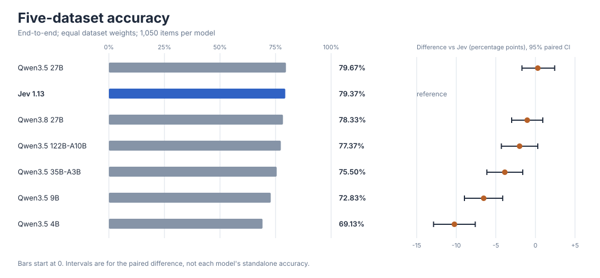
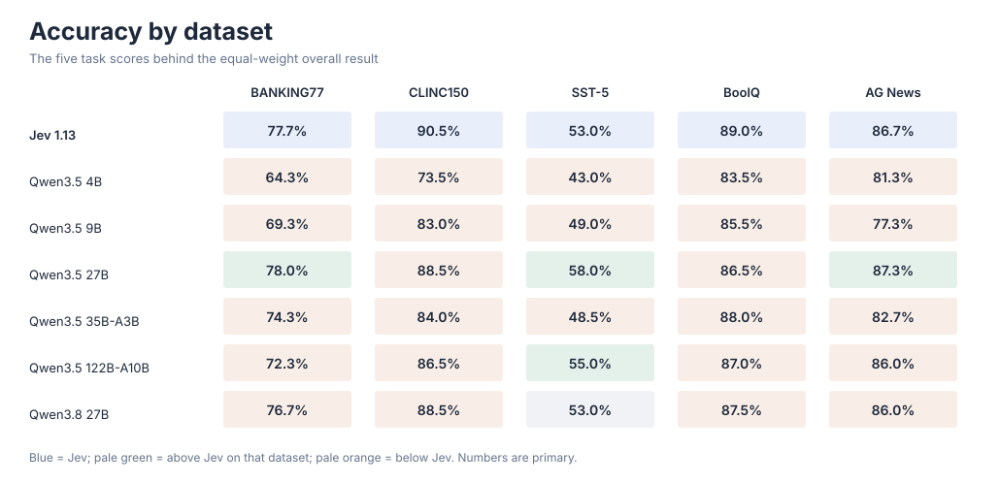
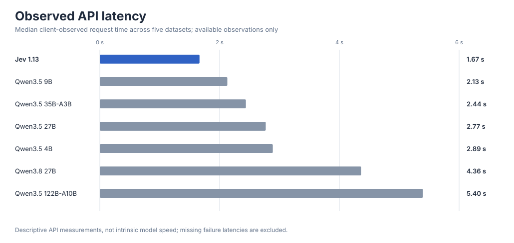

# Jev-Benchmark

**A reproducible benchmark of fast, structured decisions.** We compare Jev 1.13 with six completed Qwen runs on 1,050 frozen examples from five public datasets. The benchmark covers `choice`, `score`, and `noul` decisions; it does not test free-form generation, mathematical reasoning, or multi-step agents.

[中文完整报告](report/RESULTS.md) · [Methods](DESIGN.md) · [Reproduction](REPRODUCING.md) · [Data provenance](DATA_PROVENANCE.md) · [Experiment log](EXPERIMENT_LOG.md)

## Main result

The primary metric is the **equal-weight mean of five end-to-end dataset accuracies**. Malformed or failed predictions count as incorrect. All seven models have an attempted prediction for every one of the 1,050 items.



| Model | Overall accuracy | Candidate − Jev | Paired 95% interval | Two-sided paired p |
|---|---:|---:|---:|---:|
| Jev 1.13 | 79.37% | reference | — | — |
| Qwen3.5 4B | 69.13% | −10.23 pp | [−12.87, −7.60] pp | 0.0002 |
| Qwen3.5 9B | 72.83% | −6.53 pp | [−8.97, −4.13] pp | 0.0002 |
| Qwen3.5 27B | 79.67% | +0.30 pp | [−1.70, +2.43] pp | 0.8012 |
| Qwen3.5 35B-A3B | 75.50% | −3.87 pp | [−6.13, −1.60] pp | 0.0016 |
| Qwen3.5 122B-A10B | 77.37% | −2.00 pp | [−4.30, +0.30] pp | 0.0876 |
| Qwen3.8 27B | 78.33% | −1.03 pp | [−3.00, +0.93] pp | 0.3245 |

On these particular decision tasks, Jev's observed score is close to Qwen3.5 27B. This is **not an equivalence finding**: equivalence margins and a dedicated test were not specified. The completed Qwen3.8 27B run did not establish a statistically higher score, so this study has **not measured a capability upper bound for Jev**. These claims are scoped to the frozen items and protocol, not general model intelligence.

## Task profile



| Dataset | Decision type | Items | Split |
|---|---|---:|---|
| BANKING77 | Choice, 77 intents | 300 | test |
| CLINC150 + OOS | Choice, 150 intents plus OOS | 200 | test and OOS test |
| SST-5 | Score, five sentiment levels | 200 | test |
| BoolQ | Noul, yes/no | 200 | validation |
| AG News | Choice, four categories | 150 | test |

The [full report](report/RESULTS.md) gives a separate Choice / Score / Noul leaderboard, per-dataset paired outcomes, validity counts and the limitations of mixing task types.

## Speed and cost are secondary



Jev had the lowest **observed API request median** in this set (1.67 s), compared with 2.77 s for Qwen3.5 27B and 4.36 s for Qwen3.8 27B. These are client-side, cross-provider observations, not controlled intrinsic model benchmarks. Recorded token counts multiplied by historical price placeholders give an illustrative $0.0489 per 1,000 attempted Jev items versus $0.0877 for Qwen3.5 27B; **4B and 9B are cheaper by the same estimate**, and the Qwen3.8 USD price is missing. The estimates are not invoices or current prices. See the [methods and exact denominators](report/RESULTS.md#延迟与成本描述性维度).

## Reproduce the published analysis

The public repository contains a text-free, per-item correctness table, archived model predictions, and the source-backed statistical output. The first two commands need only Python 3.10+ and the standard library:

```bash
python3 -m unittest discover -s tests -v
python3 -m scripts.verify_release
```

The verifier recomputes all published primary scores, dataset results, paired 95% bootstrap intervals, McNemar tests and paired permutation p-values from 1,050 paired rows. To rebuild the figures after reconstructing the upstream datasets:

```bash
python3 -m scripts.build_publication
```

See [REPRODUCING.md](REPRODUCING.md) for frozen hashes, dataset acquisition, API reruns, and run provenance. Third-party benchmark text is fetched from its owners instead of being relicensed here; see [DATA_PROVENANCE.md](DATA_PROVENANCE.md). The core scoring code uses only the standard library; BoolQ acquisition additionally needs `pyarrow`.

## What is retained

- `results/raw-complete.tar.gz`: all 35 per-item response files for the seven complete models, with validity flags, observed latency and token counts. Its checksum is in `results/ARCHIVES.sha256`.
- `results/reanalysis.csv`: one text-free row per gold item, with paired correctness bits for every complete model.
- `results/statistics_with_upper.json`: exact input hashes, protocol, all paired estimates and significance tests.
- `results/efficiency.json`: aggregate API latency and explicitly qualified cost estimates.
- `results/manifests/` and `results/history.tar.gz`: the complete Qwen3.8 27B run's original manifest and snapshot, plus historical summaries and the interrupted 397B audit. Earlier runs have weaker provenance, documented in the [experiment log](EXPERIMENT_LOG.md).

An attempted Qwen3.5 397B run stopped after provider HTTP 402 credit failures. It is excluded from every completed-model ranking. DeepSeek V4 was not run as a full benchmark. The archive records these decisions without treating provider payment failure as a model error.

## Scope and limitations

This is a study of short, public, English decision datasets. Public data may overlap model training material and does not reproduce a Jev production workload. Jev emits native structured probabilities; Qwen models were prompted to emit JSON probabilities with thinking disabled. The APIs, serving conditions and historical model revisions were not controlled across providers. Descriptive cost and latency figures should not be interpreted as isolated model properties. See [the report](report/RESULTS.md) for the full interpretation.

## License and citation

Benchmark code, figures, and project documentation are released under [MIT](LICENSE). Source dataset rights remain with their owners; [DATA_PROVENANCE.md](DATA_PROVENANCE.md) lists upstream sources and known license caveats. Please cite the original dataset papers as well as this repository when using its results.
