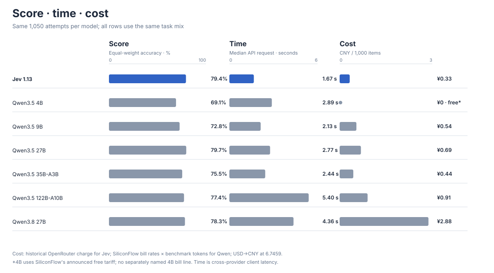

# JEV-Benchmark 当前结果

版本：2026-09-23。结论只适用于本项目冻结的五项公开决策题和记录的无思考 JSON 协议；它不是 Jev 的通用智能排名。


图中左侧绝对准确率从零开始；右侧是“候选模型减 Jev”的百分点差值与 95% 配对 bootstrap 区间。图表由 `python3 -m scripts.build_publication` 从冻结结果生成。

## 一句话结论

Jev 与 Qwen3.5-27B 在本套题上的观测表现接近。新测的 Qwen3.8-27B **没有超过 Jev**；本轮按用户指定到此停止，因此**尚未测得一个统计上胜过 Jev 的上界模型**。

## 主指标

每个模型在 1,050 道题上运行。先算每项任务的端到端准确率，再对五项任务等权平均；格式或网络失败计错。SST-5 用概率最高的档位计算精确准确率。差值为“候选模型 − Jev”，95% 区间由逐数据集配对 bootstrap 得到；双侧 `p` 为逐题配对置换检验，5,000 次、seed=42。统计方法和完整输入 SHA-256 见 `results/statistics_with_upper.json`。

| 模型 | 五项等权准确率 | 相对 Jev 差值 | 95% 配对区间（百分点） | 双侧 p | 有效预测 |
|---|---:|---:|---:|---:|---:|
| Jev 1.13 | 79.37% | 基准 | — | — | 1,050/1,050 |
| Qwen3.5-4B | 69.13% | −10.23 | [−12.87, −7.60] | 0.0002 | 1,034/1,050 |
| Qwen3.5-9B | 72.83% | −6.53 | [−8.97, −4.13] | 0.0002 | 1,042/1,050 |
| Qwen3.5-27B | 79.67% | +0.30 | [−1.70, +2.43] | 0.8012 | 1,049/1,050 |
| Qwen3.5-35B-A3B | 75.50% | −3.87 | [−6.13, −1.60] | 0.0016 | 1,041/1,050 |
| Qwen3.5-122B-A10B | 77.37% | −2.00 | [−4.30, +0.30] | 0.0876 | 1,031/1,050 |
| Qwen3.8-27B | 78.33% | −1.03 | [−3.00, +0.93] | 0.3245 | 1,047/1,050 |

“未检出差异”不能证明 Jev 与 27B 等价。若要使用等价性表述，需要先定义可接受的差距，再做对应检验。上述多模型比较主要描述现有数据；Qwen3.8-27B 是本轮完成的上界候选，其单侧“胜过 Jev”配对置换 `p=0.8440`，未达到预定的 `p<0.05` 标准。

## 新增上界候选逐项结果


| 数据集 | 样本数 | Jev 正确 | Qwen3.8-27B 正确 | 差值（百分点） |
|---|---:|---:|---:|---:|
| BANKING77 | 300 | 233 | 230 | −1.00 |
| CLINC150 + OOS | 200 | 181 | 177 | −2.00 |
| SST-5 | 200 | 106 | 106 | 0.00 |
| BoolQ | 200 | 178 | 175 | −1.50 |
| AG News | 150 | 130 | 129 | −0.67 |

Qwen3.8-27B 的 3 条无效预测都在 BANKING77，均为格式错误。新模型在五项任务中没有一项超过 Jev；以上是观测结果，不等于证明 Jev 对该模型具有普遍优势。

## 任务分榜

总分用于一个预先固定的主比较；分榜保留不同决策原语的边界。Choice 为 BANKING77、CLINC150、AG News 三集等权平均；Score 为 SST-5；Noul 为 BoolQ。所有数值均为端到端准确率，失败预测计错。

| 模型 | Choice | Score | Noul |
|---|---:|---:|---:|---:|
| Jev 1.13 | 84.94% | 53.00% | **89.00%** |
| Qwen3.5-4B | 73.06% | 43.00% | 83.50% |
| Qwen3.5-9B | 76.56% | 49.00% | 85.50% |
| Qwen3.5-27B | 84.61% | **58.00%** | 86.50% |
| Qwen3.5-35B-A3B | 80.33% | 48.50% | 88.00% |
| Qwen3.5-122B-A10B | 81.61% | 55.00% | 87.00% |
| Qwen3.8-27B | 83.72% | 53.00% | 87.50% |

这三个分榜只有 3/1/1 个数据集，不能凭分榜排名宣称模型普遍强弱。尤其 SST-5 的五级精确准确率低于其他任务，不能将不同原语的百分比解释为相同难度。

## 延迟与成本：描述性维度



下表的延迟为客户端记录的单请求往返时间中位数，而非模型纯推理时间。不同模型经过不同供应商、排队和请求负载；网络失败中没有延迟值的记录不进入中位数。成本均按**每 1,000 次评测调用**归一化：Jev 的 1,050 条原始记录用输入、输出 token 数多重集合与 OpenRouter 活动导出逐一匹配，累计活动费用 $0.050819；以 2026-09-22 的 [人民币汇率中间价 1 美元 = 6.7459 元](https://www.safe.gov.cn/AppStructured/hlw/RMBQuery.do)换算。收费的 Qwen 模型使用本次实际调用的硅基流动账单单价（元 / K tokens），乘以评测原始记录的输入、输出 token 数。Qwen3.5-4B 使用[硅基流动公布的免费定价](https://www.siliconflow.cn/news/yg6n19y2g6frnp4koxu8ye48)，记为 ¥0；它不是按模型名逐笔核对出的账单金额。这些是**历史评测的 API 费用口径**，并非整个账户账单；不含充值手续费、税费等未记录开销，也不是未来价格承诺。

| 模型 | 五项等权得分 | 延迟中位数 | 有延迟记录 | 评测成本 CNY / 1,000 题 |
|---|---:|---:|---:|---:|
| Jev 1.13 | 79.37% | **1.67 s** | 1,050/1,050 | **¥0.3265** |
| Qwen3.5-4B | 69.13% | 2.89 s | 1,050/1,050 | **¥0（平台免费定价）** |
| Qwen3.5-9B | 72.83% | 2.13 s | 1,050/1,050 | ¥0.5435 |
| Qwen3.5-27B | 79.67% | 2.77 s | 1,049/1,050 | ¥0.6897 |
| Qwen3.5-35B-A3B | 75.50% | 2.44 s | 1,045/1,050 | ¥0.4432 |
| Qwen3.5-122B-A10B | 77.37% | 5.40 s | 1,039/1,050 | ¥0.9060 |
| Qwen3.8-27B | 78.33% | 4.36 s | 1,050/1,050 | ¥2.8775 |

在这组 API 记录里 Jev 的延迟中位数最低。**Qwen3.5-4B 的平台 API 价格最低（免费）**，但其得分低于 Jev 10.23 个百分点；在收费且有可归属账单数据的模型中，Jev 的每 1,000 题历史费用最低。Jev 与 27B 的分数差异未达到统计显著，延迟和成本数据可供部署选型参考，但不能据此宣称 Jev 跨供应商具有固有速度或价格优势。

账单核对：OpenRouter 活动文件含 1,198 次 Jev 调用，其中 1,050 次与评测原始 token 对匹配，148 次额外调用已排除。硅基流动的 Qwen3.5-35B 账单输入、输出 token 总量与评测记录**完全相同**；其余收费 Qwen 模型的账户账单都包含额外用量，因此使用观察到的稳定单价计算评测部分。Qwen3.5-4B 没有独立可识别账单项；导出虽有零元 `free-text-model` 记录，但不能按模型名归属，因此 4B 的 ¥0 依据是平台官方免费定价，而非推断这批零元记录全属 4B。OpenRouter 单次费用精度为 $0.000001，合计受逐笔四舍五入影响。私有账单不公开，脱敏后的单价、源文件 SHA-256、匹配检查与汇率来源在 [`results/billing_evidence.json`](../results/billing_evidence.json)；计算结果在 [`results/efficiency.json`](../results/efficiency.json)，重做方法见 [`REPRODUCING.md`](../REPRODUCING.md)。

## 留痕与局限

- 五份金标的 SHA-256 与历史 `datasets/*.meta.json` 相符；统计脚本确认每个纳入比较的模型在各数据集都有完整且唯一的样本 ID。旧 30 份 raw 文件和新 5 份 raw 文件均收于 `results/raw-complete.tar.gz`，其校验值在 `results/ARCHIVES.sha256`。
- Qwen3.8-27B 的命令、协议、源码/金标哈希在 `results/manifests/20260923T005308Z_qwen3.8-27b.json`；原运行快照收于 `results/history.tar.gz`。原运行摘要把缺失的美元牌价显示为 `$0`；这不是免费。`summary_merged.json` 保留原始的 `unavailable` 占位，新账单核对成本单列于 `efficiency.json`。
- Qwen3.5-397B 只完成 BANKING77，CLINC150 遇到 OpenRouter HTTP 402 余额不足，SST-5 也未完成。中断痕迹保留在原本地项目，不随公开仓库发布；它**没有**进入主表，402 也未作为模型能力错误计分。
- 2026-09-23 口径修正：只有选项集中含 `oos` 时才应用 0.35 阈值。原规则曾让 BANKING77 的 Qwen3.5-4B 和 27B 各多计错 1 条；修正后直接从原始预测重算，**Jev 与 Qwen3.8-27B 的比较数值不变**。原始预测未修改。
- 公开分类金标可能与模型训练语料重叠，也不代表真实业务分布。Jev 的原生概率与 LLM 生成的 JSON 概率机制不同；校准、延迟和成本的描述性指标在 `summary_merged.json`，不应直接解释为纯模型能力差异。

## 复算

无需数据集原文和 API 凭据，可在公开仓库中先执行：

```bash
python3 -m unittest discover -s tests -v
python3 -m scripts.verify_release
```

它会对 1,050 个样本的公开正确性矩阵重算并核对主分数、逐项配对区间、McNemar 检验及总体置换检验。若要从原始模型输出重新评分，先从上游重建金标并确认哈希，再运行：

在项目根目录执行：

```bash
python3 -m unittest discover -s tests -v
python3 -m jevbench.aggregate
python3 -m jevbench.statistics --models qwen3.5-4b qwen3.5-9b qwen3.5-27b qwen3.5-35b qwen3.5-122b qwen3.8-27b --draws 5000 --out results/statistics_with_upper.json
```

统计复算无需 API 密钥；重新获取模型输出才需要密钥和供应商服务。数据再分发说明见 `DATA_PROVENANCE.md`，具体步骤见 `REPRODUCING.md`。运行计划的变化与旧结果的可追溯限制见 `EXPERIMENT_LOG.md`。
